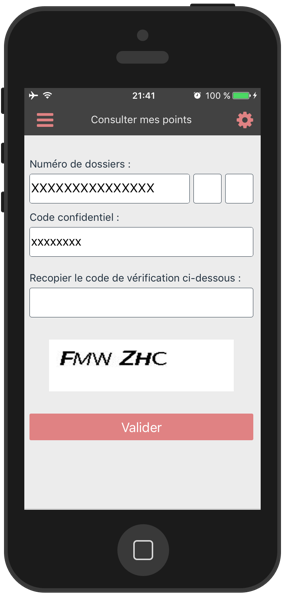

# PermisDocteWebsite
PermisDocte app website

## What is it about

French driving license merit points consult application.

**FREE application**

## Technically speaking

application PermisDocte (ios)
 - React native

Website :
 - ReactJS
 - Bootstrap 3.x
 - webpack (hot reload ...)

## Why no android version?
Android version exists but can't be released...

**The application connects to an offical website.**
Problem is: 

>this official website (old website) can't be displayed in android anymore (on chrome dektop version this website will show you `ERR_SSL_VERSION_OR_CIPHER_MISMATCH`).

